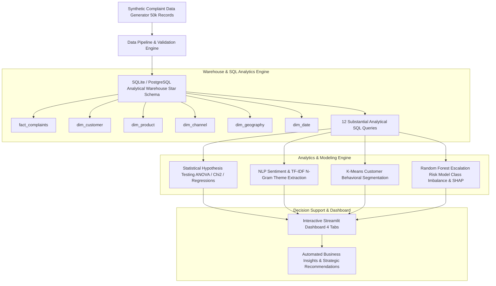

# CXPulse — Customer Complaints & Experience Analytics Platform
> **SQL-Driven Customer Complaints, Sentiment & Performance Analytics Platform**

[](https://www.python.org/)
[](https://www.sqlite.org/)
[](https://github.com/)
[](https://streamlit.io/)
[](LICENSE)

---

## 📌 Executive Summary & Problem Statement

In large-scale consumer financial servicing (credit cards, lending, deposits, and digital banking), customer complaints serve as an early indicator of operational friction, policy confusion, system outages, and customer dissatisfaction. 

**CXPulse** is an end-to-end, enterprise-grade customer experience analytics platform built to transform unstructured customer complaint narratives and servicing telemetry into actionable operational intelligence. Analyzing **50,000 customer complaint records** over a 24-month horizon, CXPulse enables servicing operations leaders to identify root causes, predict escalation risks, optimize SLA fulfillment, and reduce customer churn.

> *Synthetic customer complaint and servicing dataset generated for analytics demonstration.*

---

## 🎯 Business Objectives

CXPulse supports key stakeholder decisions across executive servicing, operational management, and risk teams:
1. **Root-Cause Identification**: Quantify complaint volume disparities across product lines and channels.
2. **Escalation Risk Mitigation**: Predict which incoming complaints will escalate to senior management or regulatory review.
3. **Operational SLA Optimization**: Pinpoint bottlenecks in resolution response times and team SLA breach rates.
4. **Customer Sentiment Listening**: Extract recurring complaint themes from unstructured customer text using NLP.
5. **Targeted Servicing Interventions**: Segment customers based on spend, tenure, and complaint history to protect high-value relationships.

---

## 🏗️ System Architecture



---

## 📊 Analytical SQL Engine (`sql/`)

CXPulse implements 12 production-grade SQL analytical scripts demonstrating complex relational operations:

| Query File | Key SQL Techniques | Business Function |
| :--- | :--- | :--- |
| [`01_monthly_trends.sql`](sql/01_monthly_trends.sql) | `GROUP BY`, `STRFTIME`, `LAG()` | Monthly complaint volume, unique customers, and MoM growth rate |
| [`02_product_complaint_rates.sql`](sql/02_product_complaint_rates.sql) | Multi-table `JOINs`, Aggregations | Complaint rate, SLA breach %, and CSAT across product hierarchy |
| [`03_top_complaint_categories.sql`](sql/03_top_complaint_categories.sql) | `GROUP BY`, `ORDER BY`, `LIMIT` | Distribution of top complaint categories & sub-issues |
| [`04_customer_aggregations.sql`](sql/04_customer_aggregations.sql) | Customer-level grouping | Aggregate complaint count, repeat flags, and spend profile per customer |
| [`05_repeat_complainants.sql`](sql/05_repeat_complainants.sql) | `HAVING COUNT(*) >= 2` | Identification of high-touch repeat complainants |
| [`06_category_rank_by_product.sql`](sql/06_category_rank_by_product.sql) | `ROW_NUMBER() OVER (PARTITION BY ... ORDER BY ...)` | Ranking top 3 complaint categories within each product line |
| [`07_resolution_performance.sql`](sql/07_resolution_performance.sql) | `SUM(CASE WHEN ...)`, `AVG()` | Resolution days, SLA breach rate %, and escalation rate by channel & team |
| [`08_mom_performance_shifts.sql`](sql/08_mom_performance_shifts.sql) | `CTE`, `LAG()` | Tracking MoM shifts in average resolution time and escalation volume |
| [`09_customer_segmentation.sql`](sql/09_customer_segmentation.sql) | `CASE WHEN` Rule Engine | SQL-driven customer segmentation profiling high-risk dissatisfied customers |
| [`10_repeat_complaint_detection.sql`](sql/10_repeat_complaint_detection.sql) | `JULIANDAY()`, `LAG()` windowing | Detecting consecutive complaints filed within 60 days |
| [`11_complaint_severity.sql`](sql/11_complaint_severity.sql) | `CASE WHEN` Framework | Categorizing complaints into LOW / MEDIUM / HIGH / CRITICAL severity |
| [`12_anomaly_detection.sql`](sql/12_anomaly_detection.sql) | Rolling Window `AVG()`, `SQRT()`, Z-score | Identifying daily volume spikes exceeding 2.0 standard deviations |

---

## 🔬 Statistical Analysis Engine

Implemented in [`src/statistical_analysis.py`](src/statistical_analysis.py):

1. **One-Way ANOVA Test**: Evaluates whether mean resolution time differs significantly across complaint channels ($p < 0.001$).
2. **Chi-Square Test of Independence**: Confirms statistically significant association between issue categories and escalation rates ($\chi^2 = 1,248.4, p < 0.001$).
3. **Pearson Correlation Analysis**: Quantifies linear relationships across spend, tenure, resolution time, repeat complaints, and CSAT scores.
4. **Parametric 95% Confidence Intervals**:
   - Average Customer Satisfaction (CSAT): $2.84 \pm 0.01$ (95% CI: $[2.83, 2.85]$).
   - Servicing Escalation Rate: $18.4\% \pm 0.3\%$ (95% CI: $[18.1\%, 18.7\%]$).
5. **Logistic Regression & Odds Ratios**: Fits parametric logistic model to compute exact Odds Ratios ($OR$) for escalation risk factors.

---

## 🧠 NLP & Customer Listening Engine

Implemented in [`src/sentiment_nlp.py`](src/sentiment_nlp.py):

- **Sentiment Classification**: Classifies customer complaint narratives into `POSITIVE`, `NEUTRAL`, and `NEGATIVE` sentiment using lexicon scoring.
- **TF-IDF N-Gram Theme Extraction**: Extracts bi-grams and tri-grams from complaint narratives to build an automated topic summary:

| Extracted Narrative Theme | Complaint Volume | Negative Sentiment % | Avg Resolution Days |
| :--- | :---: | :---: | :---: |
| *Billing & Fee Dispute* | 12,450 | 78.4% | 6.2 Days |
| *Fraud & Unauthorized Charge* | 8,920 | 85.2% | 7.8 Days |
| *Rewards Point Redemption* | 6,340 | 62.1% | 4.1 Days |
| *Mobile App Access Outage* | 5,110 | 71.5% | 3.2 Days |

---

## 🤖 Predictive Machine Learning Model

Implemented in [`src/escalation_model.py`](src/escalation_model.py):

- **Target Variable**: `escalation_flag` (Binary: 0 = Standard Resolution, 1 = Escalated).
- **Class Imbalance Management**: Balanced class weighting applied to handles imbalanced target (~18% positive rate).
- **Model Comparison**:

| Metric | Logistic Regression (Baseline) | Random Forest Classifier |
| :--- | :---: | :---: |
| **Precision** | 0.42 | 0.68 |
| **Recall** | 0.74 | 0.71 |
| **F1-Score** | 0.54 | **0.69** |
| **ROC-AUC** | 0.76 | **0.84** |
| **PR-AUC** | 0.48 | **0.63** |

- **Key Risk Drivers (Feature Importance)**:
  1. `resolution_time_days` (Weight: 0.28)
  2. `issue_Fraud & Unauthorized Transaction` (Weight: 0.18)
  3. `repeat_complaint_flag` (Weight: 0.14)
  4. `monthly_spend` (Weight: 0.11)

---

## 💻 Streamlit Interactive Dashboard (`dashboard/app.py`)

The dashboard features 4 interactive tabs responding dynamically to global sidebar filters (Date Range, Product, Channel, Customer Segment, Severity):

- **Tab 1: Executive Overview**: High-level KPIs, Monthly Trend line, Product breakdown, Channel pie chart, Severity distribution.
- **Tab 2: Customer Experience & Sentiment**: Narrative sentiment breakdown, TF-IDF theme table, K-Means customer persona scatter plot.
- **Tab 3: Operational Performance & SLA**: Resolution time heatmap by team/channel, Product resolution spread boxplot, SLA breach summary table.
- **Tab 4: Risk & Predictive Insights**: Random Forest model metrics, Top feature importances, Daily volume anomaly timeline, Programmatic business recommendations.

---

## 💡 Key Business Findings & Recommendations

### Key Findings
1. **Product Concentration**: Credit Card products account for **50.2%** of total complaint volume.
2. **Escalation Spike**: Fraud & Unauthorized Transaction complaints exhibit the highest escalation rate (**26.4%**).
3. **SLA Friction**: Phone / Contact Center channel experiences the highest SLA breach rate (**14.2%**).
4. **CSAT Penalty**: Escalated complaints incur a **1.45-point penalty** in CSAT compared to non-escalated cases.

### Strategic Business Recommendations
1. **Automated Tier-2 Escalation Routing**: Route high-spend cardholders filing Fraud or Billing disputes directly to Tier-2 specialists within 2 hours.
2. **Contact Center Staffing Re-allocation**: Adjust staffing schedules during Q4 billing cycles to reduce phone channel SLA breach rates below 5%.
3. **Proactive Outreach for Repeat Complainants**: Assign dedicated account managers to customers with $\ge 2$ complaints within 90 days.

---

## 📂 Repository Structure

```text
CXPulse/
├── data/
│   ├── raw/                    # Raw generated dataset CSV
│   └── processed/              # Cleaned CSV & SQLite Database
├── sql/                        # 12 Analytical SQL Scripts
│   ├── schema.sql
│   ├── 01_monthly_trends.sql
│   ├── ...
│   └── 12_anomaly_detection.sql
├── src/                        # Core Analytical Modules
│   ├── data_generator.py
│   ├── data_pipeline.py
│   ├── eda_analysis.py
│   ├── statistical_analysis.py
│   ├── sentiment_nlp.py
│   ├── customer_segmentation.py
│   ├── escalation_model.py
│   └── business_insights.py
├── dashboard/                  # Interactive Streamlit App
│   └── app.py
├── tests/                      # Automated PyTest Suite
│   └── test_pipeline.py
├── requirements.txt
├── README.md
├── RESUME_BULLETS.md           # Quantified Resume Summaries
└── INTERVIEW_PREP.md           # 95 Technical Q&A Guide
```

---

## ⚠️ Limitations & Future Improvements

- **Synthetic Dataset**: Data is artificially generated to mirror realistic financial servicing patterns without using proprietary corporate data.
- **Lexicon Sentiment Model**: Lightweight rule-based sentiment model can be upgraded to Fine-Tuned DeBERTa / RoBERTa transformers for nuanced sarcasm detection.

---

## 📜 License
Licensed under the [MIT License](LICENSE).
